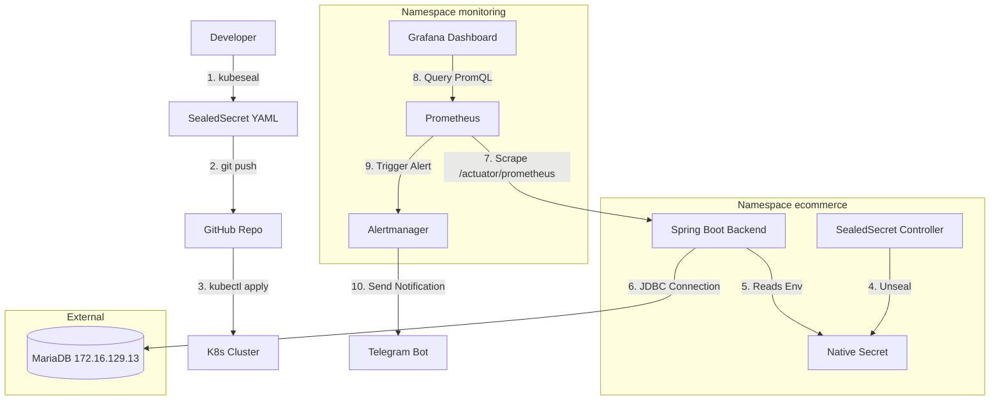

# K8s DevOps Blueprint

**Full-Stack E-Commerce Application with Kubernetes & GitOps**

An end-to-end DevOps project demonstrating the complete lifecycle of a modern application: from development and containerization to automated CI/CD and GitOps-based deployment on Kubernetes.

---

## Table of Contents
1. [Architecture Overview](#architecture-overview)
2. [Tech Stack](#tech-stack)
3. [Project Structure](#project-structure)
4. [CI/CD & GitOps Workflow](#cicd--gitops-workflow)
5. [Monitoring & Security](#monitoring--security)
6. [Local Deployment Guide](#local-deployment-guide)

---

## Architecture Overview



---

## Tech Stack

**Application**
* **Frontend**: Angular 16.2, Bootstrap 5.2
* **Backend**: Spring Boot 3.1.2, Java 17, Spring Data REST
* **Database**: MariaDB 
* **Auth**: Okta OAuth 2.0

**DevOps & Infrastructure**
* **Containerization**: Docker (Multi-stage builds)
* **Orchestration**: Kubernetes, Helm, Rancher
* **CI/CD**: GitHub Actions, ArgoCD (GitOps)
* **Networking**: Nginx Ingress Controller
* **Security**: Bitnami SealedSecrets, cert-manager (Let's Encrypt), Trivy
* **Monitoring**: Prometheus, Grafana, Alertmanager

---

## Project Structure

```text
k8s-devops-blueprint/
├── .github/workflows/ci.yml       # GitHub Actions CI pipeline
├── ecommerce-app/
│   ├── backend/                   # Spring Boot REST API & Dockerfile
│   └── frontend/                  # Angular SPA & Dockerfile
├── helm/ecommerce-app/            # Helm Chart (16 parameterized templates)
├── monitoring/                    # Prometheus Rules, Grafana Dashboards, Alertmanager
├── argocd-app.yml                 # ArgoCD Application manifest
└── README.md
```

---

## CI/CD & GitOps Workflow

### 1. Continuous Integration (GitHub Actions)
Triggered on push/PR to `main`:
1. Builds multi-stage Docker images for Frontend and Backend.
2. Scans images for vulnerabilities using **Trivy** (CRITICAL, HIGH).
3. Pushes tagged images to Docker Hub.
4. Automatically updates the image tag in the Helm `values.yaml` and commits back to the repository.

### 2. Continuous Deployment (ArgoCD GitOps)
* ArgoCD monitors the `helm/ecommerce-app` directory in the repository.
* When the CI pipeline updates the image tag, ArgoCD detects the drift and automatically synchronizes the cluster state.
* Configured with `prune: true` and `selfHeal: true` to ensure the cluster strictly matches the Git repository (Single Source of Truth).

---

## Monitoring & Security

**Monitoring (Prometheus & Grafana)**
* Cross-namespace metric scraping via `ServiceMonitor`.
* 2 Custom Grafana Dashboards: JVM Heap/HTTP metrics and MariaDB connections/slow queries.
* 9 Alertmanager rules covering: Node resource exhaustion, OOMKilled pods, StatefulSet failures, and HTTP 5xx spikes.

**Security & Secret Management**
* Secret management is fully integrated into the GitOps workflow using **Bitnami SealedSecrets** (as illustrated in the Architecture Overview).
* Automated TLS certificate provisioning via **cert-manager**.
* Minimum privilege configuration and strict CORS policies.
* Actuator endpoints restricted, except for Kubernetes health probes and Prometheus scraping.

---

## Screenshots

**ArgoCD GitOps Dashboard**


**Rancher Cluster Management**


**Prometheus & Grafana (HikariCP / JVM Metrics)**


**Alertmanager Telegram Notifications**


**E-Commerce Storefront**


---

## Local Deployment Guide

### Prerequisites
* Docker 20.10+
* Kubernetes Cluster (minikube/kind) 1.25+
* ArgoCD CLI
* Helm 3.x

### 1. Install ArgoCD
```bash
kubectl create namespace argocd
kubectl apply -n argocd -f https://raw.githubusercontent.com/argoproj/argo-cd/stable/manifests/install.yaml
kubectl wait --for=condition=available deployment/argocd-server -n argocd --timeout=300s
```

### 2. Apply Sealed Secrets Controller
Ensure the Bitnami Sealed Secrets controller is installed in your cluster to decrypt the application credentials.

### 3. Deploy Application via GitOps
```bash
# Apply ArgoCD Application manifest
kubectl apply -f argocd-app.yml
```
ArgoCD will automatically create the `ecommerce` namespace and deploy all resources defined in the Helm chart.

---
*Developed by [Nguyen Thanh Huy](https://github.com/Nguyen-Thanh-Huy-io)*
